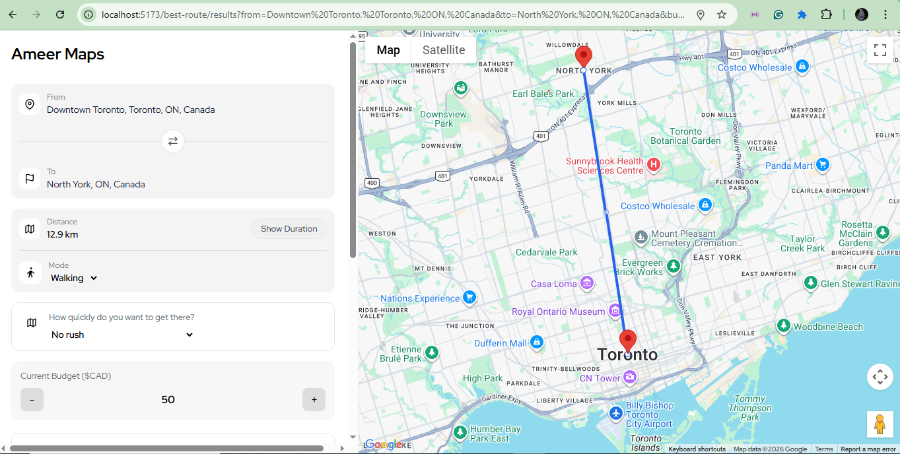
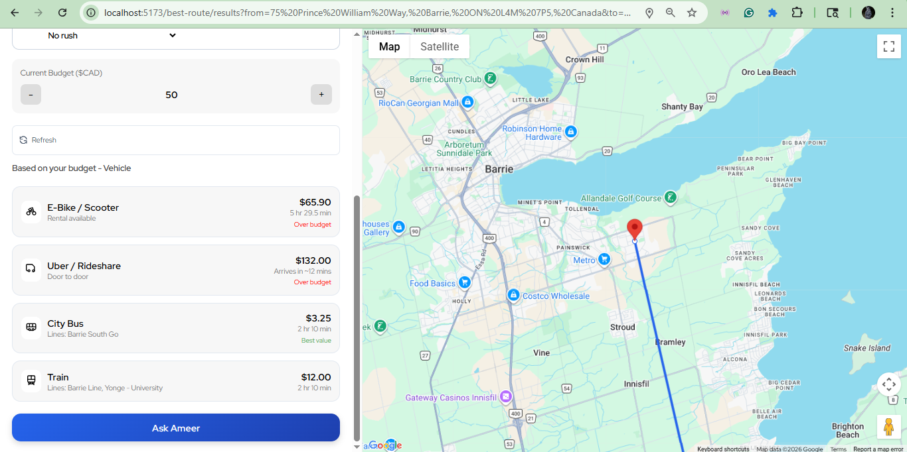

# Ameer AI

Ameer AI is an advanced trip budgeting application built with **TypeScript**, **Go**, **MongoDB**, and the **Gemini API**. The platform enables users to plan and manage travel budgets in real time by leveraging Google’s geolocation and routing APIs. It provides dynamic cost estimates based on routes, distance, and transportation methods, while also offering personalized AI-driven travel recommendations and budgeting advice through an intelligent assistant.

---

## Motivation

Trips can often feel overwhelming, especially when travelling solo. Ameer AI was created to help people navigate and enjoy the outdoors with a fixed, reliable budget—removing uncertainty and reducing the stress or fear that can come with exploring new places. The goal and the driving factor behind this app is to make travel more accessible, confident, and enjoyable through real-time budgeting and a reliable guidance. 

### Prerequisites

Make sure you have the following installed on your machine:

- **Git**
- **Node.js**
- **npm** 

---

## Quick Start


  ```bash
    git clone https://github.com/jonuoha60/Ameer-AI.git
    cd Ameer-AI
    npm install
```

**Frontend Setup**

  ```bash
    cd frontend
    npm install
    npm run dev
```
http://localhost:3000

**Backend Setup**

 ```bash
    cd backend
    go mod tidy
    go run main.go/air
```

http://localhost:8080

---

## Project Structure 

```bash
Ameer-AI/
│
├── frontend/                # Frontend (TypeScript / React)
│   ├── public/              # Static assets (images, icons, etc.)
│   ├── src/
│   │   ├── components/      # Reusable UI components
│   │   ├── pages/           # Application pages / routes
│   │   ├── api/             # Axios api for backend 
│   │   ├── hooks/           # Custom hooks for authentications and functions
│   │   ├── services/        # API calls to backend
│   │   ├── context/         # Global state management
│   │   ├── constants/       # CSS / Icons styles
│   │   ├── styles/          # CSS / Icons styles
│   │   ├── icons/           # Icons styles
│   │   └── utils/           # Helper functions
│   │
│   ├── .env                 # Frontend environment variables
│   ├── vite.config.js
│   └── package.json
│
├── backend/                 # Backend (Go API server)
│   ├── api/                 # OpenAPI/Swagger specs, JSON schema files, protocol definition files.
│   ├── cmd/                 # Entry point
│   ├── internal/            # API route definitions, business logics, handlers
│   ├─ assistant/            # AI logic folder for handling routes, handlers, service 
│   ├─ auth/                 # JWT for authentication and token handling
│   ├─ config/               # Configuration for .env files to load
│   ├─ db/                   # Handles database connection to mongo
│   ├─ maps/                 # Business logic (budgeting, AI, maps)
│   ├─ middleware/           # Routing authentication for unverified users
│   ├─ refreshToken/         # RefreshToken logic folder for handling routes, handlers, service 
│   ├─ server/               # Creating a router to 
│   ├─ transport/            # Business logic (budgeting, AI, maps)
│   ├─ users/                # Business logic (budgeting, AI, maps)
│   ├── tmp                  # temp build files (leave empty / ignore)
│   ├── .air.toml            # For refreshing backend updates
│   ├── utils/               # Helper functions
│   ├── .env                 # Backend environment variables
│   └── go.mod
│
├── README.md
└── .gitignore
```

---

### Set Up Environment Variables

Create a new file named `.env` in the frontend of your project and add the following content:
- 📁 Frontend .env
```env
VITE_CLERK_PUBLISHABLE_KEY=
VITE_GOOGLE_MAP_API=
VITE_BASE_URL=http://localhost:8080
```
- 📁 Backend .env.local
```env
MONGO_URI=mongodb://localhost:27017
MONGO_DB_NAME=
PORT=8080
GOOGLE_MAP_API=
GEMINI_API_KEY=
JWT_REFRESH=
JWT_ACCESS=
```

## Configure


Replace the placeholder values with your actual Gemini API keys JWT SECRETS.

* You can get a Gemini API key [here](https://aistudio.google.com/app/apikey)

* You can generate a JWT SECRET in the terminal using this command

```bash
    node -e "console.log(require('crypto').randomBytes(32).toString('hex'))
```

---

## The Pipeline

```text
┌──────────────────────────────────────────────────────────────────────┐
│  User Authentication & Input                                         │
│  ├── User login / session management                                 │
│  ├── Location permissions                                             │
│  └── Route + budget preferences                                       │
└──────────────────────────────────────────────────────────────────────┘
                                │
                                ▼
┌──────────────────────────────────────────────────────────────────────┐
│  Google Maps & Geolocation Services                                  │
│  ├── Places Autocomplete API                                         │
│  ├── Geocoding API                                                    │
│  ├── Directions / Transit Routing API                                │
│  └── Distance Matrix API                                              │
└──────────────────────────────────────────────────────────────────────┘
                                │
                                ▼
┌──────────────────────────────────────────────────────────────────────┐
│  Transport Systems Integration                                       │
│  ├── Uber / rideshare pricing estimates                              │
│  ├── Public transit schedules                                         │
│  ├── Train routing + timing                                           │
│  └── Bike / scooter availability                                      │
└──────────────────────────────────────────────────────────────────────┘
                                │
                                ▼
┌──────────────────────────────────────────────────────────────────────┐
│  AI Route Optimization Engine                                        │
│  ├── Cost comparison logic                                           │
│  ├── Time vs budget optimization                                     │
│  ├── Smart route recommendations                                     │
│  └── Personalized travel insights                                    │
└──────────────────────────────────────────────────────────────────────┘
                                │
                                ▼
┌──────────────────────────────────────────────────────────────────────┐
│  Frontend Client (React)                                             │
│  ├── Real-time route display                                         │
│  ├── Budget tracking dashboard                                       │
│  ├── Travel recommendations                                          │
│  └── Interactive UI updates                                          │
└──────────────────────────────────────────────────────────────────────┘
```
---

## Core Features

* Real-time AI chat assistant that helps users plan trips and manage budgets dynamically
* Geolocation-based using reverse geocoding for navigation to help users identify their current location and plan routes to their destination
* Smart expense budgeting system that provides real-time financial guidance for affordable and stress-free travel
* Secure user authentication to personalize experiences and store user-specific travel data
* Interactive map integration powered by Google Maps for route visualization and trip planning

---

## Architecture Overview / Tech Stack
- **TypeScript**: For building the user interface and core interactions.
- **CSS**: For the interface styling and design.
- **Go**: Powers the backend services, handling API requests, authentication, trip budgeting logic, and real-time data processing. 
- **MongoDB**: For retrieving and storing user data, trip budgeting, history and authentication records. 
- **Google Maps API**: Provides geolocation services, route planning, distance calculation, and interactive map visualization.
- **GeminiAPI**: Powers the AI travel assistant, offering intelligent budgeting advice, trip recommendations, and conversational support.

## Front-End Design
The front-end is built with Next.js and TailwindCSS, providing a smooth user experience for uploading, processing, and downloading images. The app is responsive and works across a variety of devices.





---

## Future Improvements
* Use chat history to provide personalized recommendations and maintain budget awareness as users explore different locations. 
* Offer an integrated tour guide with intuitive, step-by-step navigation for effortless exploration.

---

## Credits

- Maps API: [Google Maps](https://developers.google.com/maps).
- Discovery inspiration: Uber.
- Agent runtime: [GeminiAPI](https://ai.google.dev/gemini-api/docs/quickstart).
  


